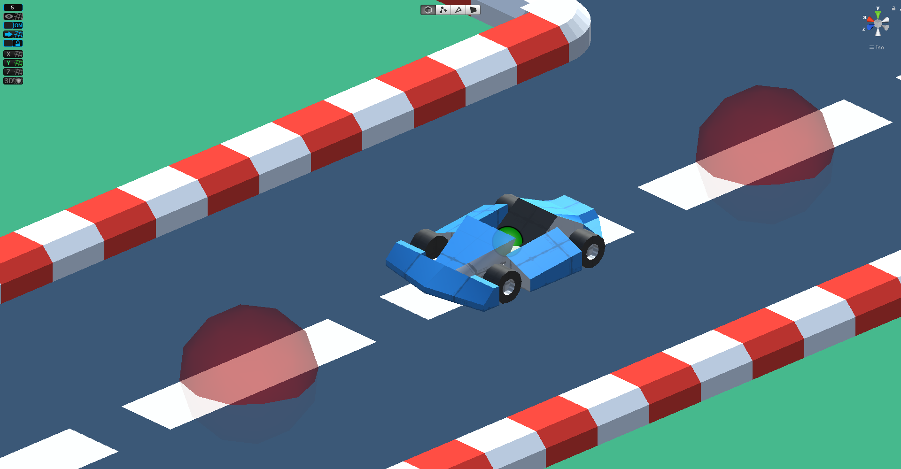

# Genetic Algorithm Kart 

Example of application of genetic algorithm for evolution kart navigation. Project developed in the discipline of Artificial Intelligence applied to the Digital Games - Fatec Americana

## Kart Game

Racing game developed at Unity 2019.2.5

  

To create the track, we used 3 tiles created with ProBuilder

  

A small kart was also modeled in ProBuilder for simulation

  

Kart with sensors

  

Manual kart control

## Genetic Algorithm (GA)

### Implementation

1.  Generate the initial population of individuals randomly. (First generation)
2.  Evaluate the fitness of each individual in that population (time limit, sufficient fitness achieved, etc.)
3.  Repeat the following regenerational steps until termination:
4.  Select the best-fit individuals for reproduction. (Parents)
5.  Breed new individuals through crossover and mutation operations to give birth to offspring.
6.  Evaluate the individual fitness of new individuals.
7.  Replace least-fit population with new individuals.

### Individual (Chromosome)

A chromosome generally means a part of a gene. In the context of evolutionary algorithms, however, a chromosome represents a potential solution to the problem. Here’s an example:

### Fitness Function

Fitness Function (also known as the Evaluation Function) evaluates how close a given solution is to the optimum solution of the desired problem. It determines how fit a solution is.

### Elitism

A practical variant of the general process of constructing a new population is to allow the best organism(s) from the current generation to carry over to the next, unaltered. This strategy is known as elitist selection and guarantees that the solution quality obtained by the EA will not decrease from one generation to the next.

### Tournament Selection

Tournament Selection is a Selection Strategy used for selecting the fittest candidates from the current generation in a Genetic Algorithm. These selected candidates are then passed on to the next generation. In a K-way tournament selection, we select k-individuals and run a tournament among them. Only the fittest candidate amongst those selected candidates is chosen and is passed on to the next generation. In this way many such tournaments take place and we have our final selection of candidates who move on to the next generation. It also has a parameter called the selection pressure which is a probabilistic measure of a candidate’s likelihood of participation in a tournament. If the tournament size is larger, weak candidates have a smaller chance of getting selected as it has to compete with a stronger candidate. The selection pressure parameter determines the rate of convergence of the GA. More the selection pressure more will be the Convergence rate. GAs are able to identify optimal or near-optimal solutions over a wide range of selection pressures. Tournament Selection also works for negative fitness values.

1.  Select k individuals from the population and perform a tournament amongst them
2.  Select the best individual from the k individuals
3.  Repeat process 1 and 2 until you have the desired amount of population

### Uniform Crossover

In a uniform crossover, we don’t divide the chromosome into segments, rather we treat each gene separately. In this, we essentially flip a coin for each chromosome to decide whether or not it’ll be included in the off-spring. We can also bias the coin to one parent, to have more genetic material in the child from that parent.

### Random Resetting Mutation

Random Resetting is an extension of the bit flip for the integer representation. In this, a random value from the set of permissible values is assigned to a randomly chosen gene.

## Experiments and Results

Initial setup of the first experiment

| Variable         	| Value 	|
|------------------	|:-----:	|
| Population size  	|  100  	|
| Elitism          	|   5%  	|
| Crossover rate   	|  50%  	|
| Mutation rate    	|   5%  	|
| Max generation   	|   20  	|
| Tournament size  	|   3   	|
| Max game time    	|   10  	|

## References

*   **ANDRADE, KLEBER O.**; JOAQUIM, RICARDO C. ; CAURIN, GLAUCO A. P. ; CROCOMO, MARCIO K. . Evolutionary Algorithms for a Better Gaming Experience in Rehabilitation Robotics. COMPUTERS IN ENTERTAINMENT, v. 16, p. 1-15, 2018.
*   GARCIA, B. E. R. ; **ANDRADE, K. O.** ; CROCOMO, M. . Dynamic Difficulty Adjustment in a Whac-A-Mole like Game. In: Simpósio Brasileiro de Games e Entretenimento Digital (SBGames), 2018, Foz do Igua¸cu ? PR. XVII Simpósio Brasileiro de Games e Entretenimento Digital, 2018.
*   **ANDRADE, KLEBER DE O.**; PASQUAL, THALES B. ; CAURIN, GLAUCO A. P. ; CROCOMO, MARCIO K. . Dynamic difficulty adjustment with Evolutionary Algorithm in games for rehabilitation robotics. In: 2016 IEEE International Conference on Serious Games and Applications for Health (SeGAH), 2016, Orlando. 2016 IEEE International Conference on Serious Games and Applications for Health (SeGAH). p. 1-8. 
*   **ANDRADE, K. O.**; SILVA, A. E. A. ; CROCOMO, M. . Um Algoritmo Evolutivo para a Adaptação de NPCs em um Jogo de Ação. In: I Simpósio Santa Catarina Games, 2009, Florianópolis. Anais do I Simpósio Santa Catarina Games - SCGAMES, 2009.

## Licença

    Copyright 2019 Kleber de Oliveira Andrade
    
    Permission is hereby granted, free of charge, to any person obtaining a copy
    of this software and associated documentation files (the "Software"), to deal
    in the Software without restriction, including without limitation the rights
    to use, copy, modify, merge, publish, distribute, sublicense, and/or sell
    copies of the Software, and to permit persons to whom the Software is
    furnished to do so, subject to the following conditions:
    
    The above copyright notice and this permission notice shall be included in all
    copies or substantial portions of the Software.
    
    THE SOFTWARE IS PROVIDED "AS IS", WITHOUT WARRANTY OF ANY KIND, EXPRESS OR
    IMPLIED, INCLUDING BUT NOT LIMITED TO THE WARRANTIES OF MERCHANTABILITY,
    FITNESS FOR A PARTICULAR PURPOSE AND NONINFRINGEMENT. IN NO EVENT SHALL THE
    AUTHORS OR COPYRIGHT HOLDERS BE LIABLE FOR ANY CLAIM, DAMAGES OR OTHER
    LIABILITY, WHETHER IN AN ACTION OF CONTRACT, TORT OR OTHERWISE, ARISING FROM,
    OUT OF OR IN CONNECTION WITH THE SOFTWARE OR THE USE OR OTHER DEALINGS IN THE
    SOFTWARE.
